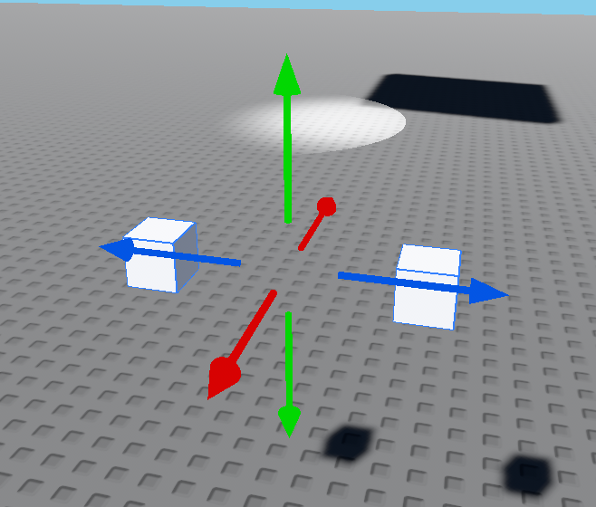

<!-- 
Model
Revision 1

Written by KingTasaz on August 28th, 2026
-->

## Summary
Models are a very simple way to group [`parts`](./part.md) together.
Creating a model requires at least `2` parts selected, but otherwise the second part can be deleted. Parts in a model are not truly connected, but only grouped in the explorer. Models currently have no purpose other than organization.

A model with no children is still shown in the explorer, but does not exist in the world and has no transform controls.

The basic transform tools (Move, Rotate) work more or less as expected when used on a model, except for scaling which currently is not properly supported.

<details>
<summary><b>Properties</b></summary>
Properties of a Model, in the order they appear on Vortex Studio.
<br><br>
<ul>

<details>
<summary><b>Properties</b></summary>

- [Name](#name): `String`
- [Position](#position): [`Vector3`](../datatypes/vector3.md)

</details>

</ul>
</details>

## Properties


### Name
> `String` \
\
The name of the `model`, and its label in the explorer.

<br/>


### Position
> [`Vector3`](../datatypes/vector3.md) \
\
The position of the `model`, in World-space.
A model's position is automatically set to the mathematical average of all its children's positions. (See [Images](#images))

<br/>

## Images


## Testing Notes

In Vortex Studio 0.3.4, a detached `Model` exposes the generic instance
surface, including hierarchy and attribute methods, but has no readable
`Position`, `PrimaryPart`, or `WorldPivot` property. This is identical in
both Script and LocalScript.

Setting a temporary Part's `Parent` to a detached Model does not establish an
observable hierarchy: parent equality is `false`, `FindFirstChild` returns
`nil`, `GetChildren()` returns an empty table, and `WaitForChild` does not
return the temporary Part.

`GetPivot`, `PivotTo`, `GetPrimaryPartCFrame`, and `SetPrimaryPartCFrame` are
also unavailable (`nil`) in both contexts. Assigning `Model.PrimaryPart` is
rejected as a non-settable property.

In 0.3.4, the live Character Model is a special case. In both a LocalScript and
a confirmed server Script, it exposes `ClassName`, `Name`, and `Position`, plus
direct `Humanoid` and `HumanoidRootPart` members; `Parent` reads as `nil`.
It exposes the tested generic Instance method surface and a connectable
`Changed` signal, but its tested hierarchy/lifecycle signals are unavailable.
Like a detached Model, its pivot and primary-part APIs remain unavailable.

`Character:FindFirstChild("Humanoid")` and
`Character:FindFirstChild("HumanoidRootPart")` return the same direct members.
However, `Character:GetChildren()` returns one unnamed generic `Instance`, not
a reliable inventory of those two values or of the tested standard R6/R15 body
parts. Character attribute values replicate in both directions between a
server Script and the owning LocalScript; see the
[Attributes guide](../../guides/attributes.md).

## Transient Character visual Scene

The unnamed child returned by `Character:GetChildren()` can expose a `Scene`
member after the visual character finishes loading. This is a separate,
transient render hierarchy; it is not part of the stable public Character
projection above. Code that needs it must poll for the route and re-resolve it
after every replacement:

```luau
local function getCharacterScene(character)
    for _, wrapper in ipairs(character:GetChildren()) do
        local ok, scene = pcall(function() return wrapper.Scene end)
        if ok and scene then
            return scene
        end
    end
end
```

In the tested 0.3.4 character, the initial visual hierarchy was:

```text
Scene
├── Armature.001
│   └── HumanoidRootPart
│       └── Torso
│           ├── Right Arm
│           ├── Left Arm
│           ├── Right Leg
│           ├── Left Leg
│           └── Head
└── Body
```

All of these visual nodes report `ClassName == "Instance"`. The observed
surface is the generic hierarchy and attribute method set, plus readable
`Name`, `Parent`, `Position`, and `Size`. `Changed`, `Touched`, and
`TouchEnded` can be connected, but no delivery was observed while a limb's
`Position` updated. The live limb transforms are therefore readable render
state, not a replacement for the public `HumanoidRootPart` projection.

The hierarchy changes during loading. In one verified run, unnamed attachment
nodes appeared below `Torso` and `Head`, then each exposed a nested `Scene`.
Their visual content included `Angel wings`, `Spike Sword`, hair, and a
`PaperPlane Hat`. Those names are avatar-specific examples, not guaranteed
children. Later, Vortex replaced the complete `Scene` and `Armature.001` with
a fresh base hierarchy; a direct `Cube` node also appeared on the replacement
Scene in the observed run. Retain no visual-node reference across frames or
loading phases—reacquire `Scene`, `Armature.001`, and any limb or attachment
from the current Character hierarchy.

Reparenting `Right Arm` and `Left Arm` from this visual hierarchy was observed
to hide the corresponding rendered arms in both a LocalScript and a server
Script. This is an implementation detail rather than a stable character API;
test it against the target avatar and expect visual Scene replacements to undo
the change.
